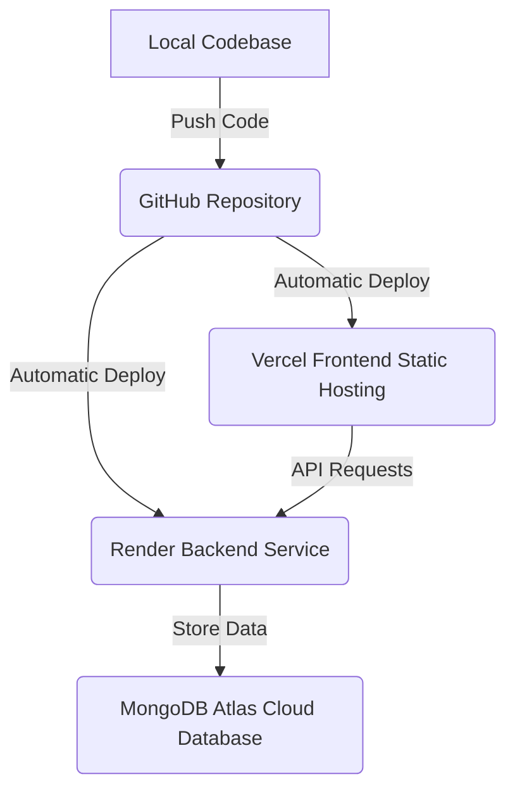

# 🌟 Expensio — Premium Glassmorphic MERN Finance Tracker

[](https://opensource.org/licenses/MIT)
[](https://react.dev)
[](https://vite.dev)
[](https://nodejs.org)
[](https://www.mongodb.com)
[](https://github.com/firstcontributions/first-contributions)

**Expensio** is a premium, visually stunning open-source personal finance application built on the **MERN (MongoDB, Express, React, Node.js)** stack. Built with ultra-modern **glassmorphism styling**, vibrant HSL color palettes, responsive analytics, and elegant transitions, Expensio redefines budgeting and expense tracking for the modern web.

---

## 🎨 Visual Aesthetics & Premium UI

Expensio prioritizes premium web aesthetics and user experience over typical boilerplate dashboards:
* **Floating Glassmorphic Header**: An elegant, translucent top navigation bar with custom backdrop filters (`backdrop-blur-md`), floating pill selectors, and high-contrast responsive controls.
* **Widescreen-Aligned Dashboard**: Complete elimination of grid gaps on widescreen monitors. Featuring a seamless **4-column responsive card layout** for quick metrics and a side-by-side transaction grid on wide screens.
* **MacOS-Style Mockup Windows**: The Welcome, Login, and Signup pages feature glassmorphic interactive device mockups, custom ambient gradients, and soft floating drop shadows.
* **High Contrast Charts**: Integrated **Recharts** visualizations configured with precise label margins, high-contrast HSL legends, and interactive tooltips to prevent any data clipping.
* **Smart Color Theme Engine**: Full reactive dark and light theme toggles that smoothly transition between a deep premium dark glass look and a crisp, light, gray-glassmorphic aesthetic.

---

## 🚀 Key Open-Source Features

1. **Multi-Granular Timeframe Analytics**: Toggle dashboard calculations instantly between **Daily, Weekly, Monthly, and Yearly** intervals.
2. **Custom Calendar Period Drilldown**: Pick precise dates using responsive range calendars to explore cash flows inside any historical or future timeframe.
3. **Optimized Profile System**: Upload and crop profile pictures with zero third-party dependencies, supported by backend-adapted Base64 upload pipelines.
4. **Data Portability**: Download fully formatted `.xlsx` ledger sheets of all income and expense transactions in a single click.
5. **Secure Authentication**: Stateful JSON Web Token (JWT) tracking with customizable "Remember Me" session duration. Safe one-way cryptographically salted passwords using `bcryptjs`.

---

## 📂 Codebase Architecture

```text
ExpenseTracker-main/
├── backend/                    # Express.js Server API
│   ├── controllers/            # Core handlers (Auth, Income, Expense, Dashboard)
│   ├── models/                 # Mongoose schemas (User, Income, Expense)
│   ├── utils/                  # JWT auth middleware and helpers
│   ├── .env                    # Secret environment credentials (git-ignored)
│   └── server.js               # Express application entrypoint
│
└── frontend/                   # Vite React SPA Client
    ├── public/                 # Static public assets
    ├── src/
    │   ├── assets/             # Global CSS and dummy data variables
    │   ├── components/         # Glassmorphic Navbar, Layout, Modals, Forms
    │   ├── pages/              # Welcome, Dashboard, Income, Expense, Profile
    │   ├── utils/              # Excel ledger generators
    │   ├── App.jsx             # React routing setup
    │   └── main.jsx            # Vite mounting root
    ├── vercel.json             # Single Page Routing configurations for Vercel
    └── vite.config.js          # Vite and Tailwind bundle presets
```

---

## 💻 Local Setup & Development

To launch the project locally on your machine, follow these instructions:

### 1. Prerequisites
Ensure you have [Node.js (v18+)](https://nodejs.org) and [Git](https://git-scm.com) installed.

### 2. Configure Backend Server
1. Navigate to the backend folder:
   ```bash
   cd ExpenseTracker-main/backend
   ```
2. Install server dependencies:
   ```bash
   npm install
   ```
3. Create a `.env` file inside the `backend/` directory:
   ```env
   PORT=4000
   MONGO_URI=your_mongodb_atlas_connection_string
   JWT_SECRET=any_secure_random_string_key
   ```
4. Launch the local API server:
   ```bash
   npm start
   ```

### 3. Configure Frontend Client
1. Open a new terminal and navigate to the frontend folder:
   ```bash
   cd ExpenseTracker-main/frontend
   ```
2. Install frontend dependencies:
   ```bash
   npm install
   ```
3. Run the Vite development compiler:
   ```bash
   npm run dev
   ```
4. Navigate to `http://localhost:5173/` in your browser to explore!

---

## ☁️ Step-by-Step Live Deployment Guide

Deploy your open-source Expensio tracker to production completely free using the following modern architecture:



### 📦 Step 1: Create a New GitHub Repository & Push
1. Go to [github.com/new](https://github.com/new) and create a **new, empty repository** (e.g., named `Expensio-App`). Leave "Add a README", ".gitignore", and "License" unchecked.
2. Open your terminal in the main folder and add your new remote:
   ```bash
   # Add your repository as origin
   git remote add origin https://github.com/your-username/your-repo-name.git
   
   # Rename default branch to main and push
   git branch -M main
   git push -u origin main
   ```

### 🍃 Step 2: Set Up MongoDB Atlas (Free Cloud Database)
1. Register/Login at [mongodb.com/atlas](https://www.mongodb.com/cloud/atlas) and set up a **Free Shared Cluster (M0)**.
2. In **Database Access**, create a user with a secure password (e.g., `expensio_user`). Remember this password.
3. In **Network Access**, click **Add IP Address** and enter `0.0.0.0/0` (Allow Access from Anywhere) to permit Render's servers to connect.
4. Go to your Database Cluster dashboard, click **Connect** -> **Drivers**, and copy the connection string. Replace `<password>` with your database user password:
   ```text
   mongodb+srv://expensio_user:<password>@cluster0.xxxx.mongodb.net/expensio?retryWrites=true&w=majority
   ```

### 🚀 Step 3: Deploy Backend API to Render
1. Login to the [Render Dashboard](https://dashboard.render.com/) and click **New +** -> **Web Service**.
2. Connect your GitHub account, find your repository, and select it.
3. Configure the following fields:
   * **Name**: `expensio-backend-api`
   * **Root Directory**: `backend`
   * **Runtime**: `Node`
   * **Build Command**: `npm install`
   * **Start Command**: `node server.js`
4. Expand **Environment Variables** and add:
   * `MONGO_URI` = `<Your MongoDB Atlas Connection String>`
   * `JWT_SECRET` = `<Any Secure Private String>`
5. Click **Create Web Service**. Render will automatically build and launch your backend! 
6. **Copy the live URL** once active (e.g., `https://expensio-backend-api.onrender.com`).

### ⚡ Step 4: Deploy Frontend Client to Vercel
1. Login to the [Vercel Dashboard](https://vercel.com/) and click **Add New** -> **Project**.
2. Import your GitHub repository.
3. Configure the build parameters:
   * **Framework Preset**: `Vite` (automatically detected).
   * **Root Directory**: Click Edit and select the `frontend` folder.
4. Expand **Environment Variables** and add:
   * `VITE_API_URL` = `https://your-render-url-here.onrender.com/api` (Make sure to append `/api` at the end!)
5. Click **Deploy**. Vercel will bundle your assets and serve them globally on a premium `.vercel.app` domain. 

*Your fully glassmorphic MERN application is now globally live, securely connected, and ready to show the world!*

---

## 🤝 Contributing

Contributions are what make the open-source community such an amazing place to learn, inspire, and create. Any contributions you make are **greatly appreciated**.

1. Fork the Project
2. Create your Feature Branch (`git checkout -b feature/AmazingFeature`)
3. Commit your Changes (`git commit -m 'Add some AmazingFeature'`)
4. Push to the Branch (`git push origin feature/AmazingFeature`)
5. Open a Pull Request

---

## 📄 License

Distributed under the MIT License. See `LICENSE` for more information.

---

*Made with 💖 by Mahesh Sharma and the Open Source Community.*
